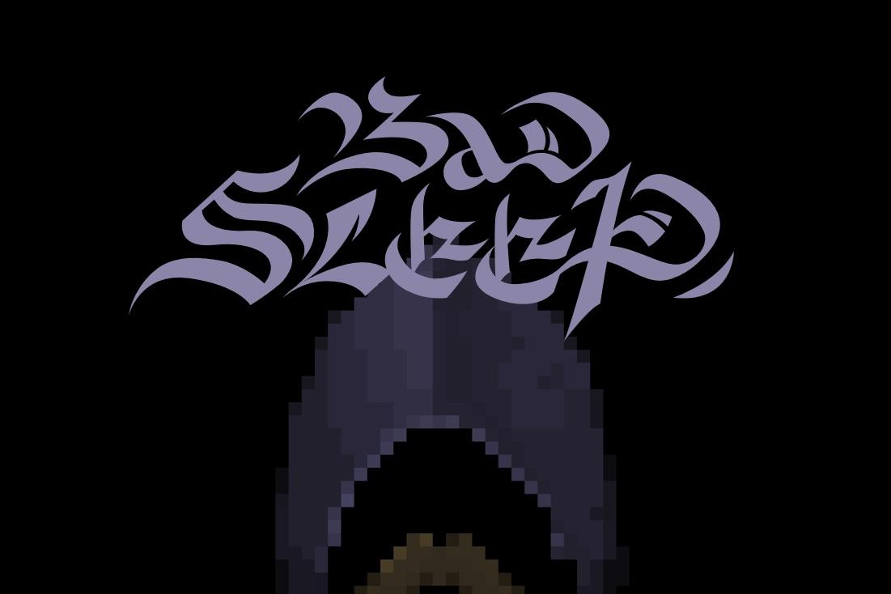
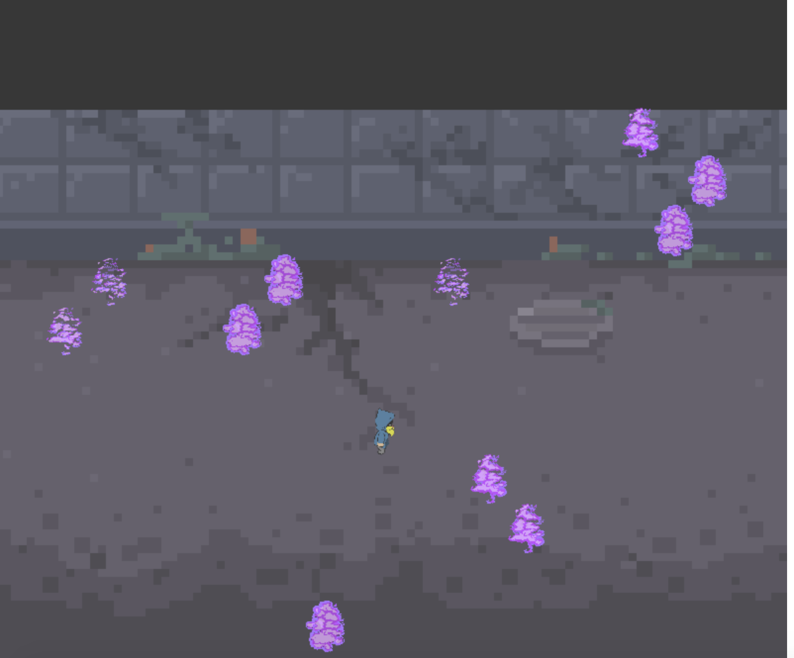
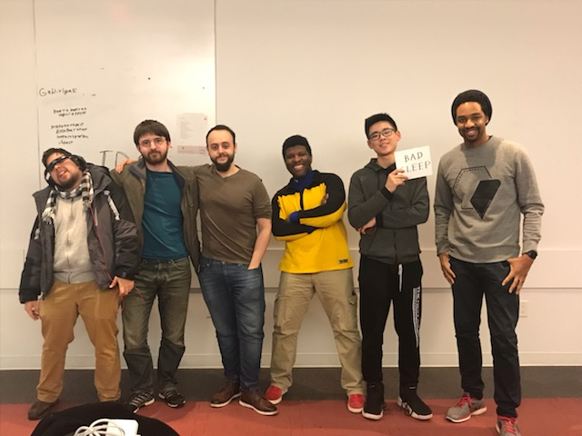

Global Game Jam event hosted at NYU

The Mission build a game with the theme of "What Home Means To You"

We decided that home meant a place where you sleep.

The Game was built using Phaser.js

The Team, from left to right:
(Carlos Abdu, Douglas Rysdyk, Dmitriy Tyutyunik, Gabriel Lemaine, Nicky, Mansa)

Link to deployed game <http://bad-sleep.surge.sh>
